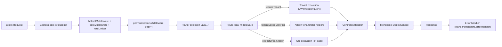

# Backend API Analysis (Express + MongoDB)

## Overview

This document provides a thorough analysis of the Express backend API for the Data Management Dashboard. It enumerates all discovered HTTP routes/endpoints, their HTTP methods and paths, how they map to controllers/handlers, the middleware chains applied (authentication, tenant scoping, validation, error handling), the data models/services in use, and the request/response behaviors including pagination, sorting, filtering, and typical status codes. It also explains cross-cutting security (JWT, Super Admin/T0000 bypass, rate limiting, CORS/Helmet) and utilities that influence API behavior. All file paths listed below are relative to the backend container root: mongodb_dashboard_backend.

The implementation uses Express.js, Mongoose, and a multi-tenant approach enforced via tenant-aware middleware. Swagger/OpenAPI is generated dynamically and served from this backend for discovery and docs.

## Server Composition and Cross-Cutting Middleware

The main application wiring is defined in:
- src/app.js
- src/server.js

Key composition:
- Helmet, CORS, and Rate Limiting:
  - src/middleware/security.js exports:
    - corsMiddleware(): dynamic whitelist CORS with permissive same-host fallback
    - helmetMiddleware(): secure headers (CSP off to avoid clashes with Swagger UI), cross-origin resource policy relaxed
    - rateLimiter(): express-rate-limit with GET skipping by default
  - src/middleware/permissiveCors.js exports permissiveCorsMiddleware used under /api to echo Origin and handle preflight broadly
  - app.js mounts:
    - helmetMiddleware globally
    - corsMiddleware globally
    - permissiveCorsMiddleware under /api
    - explicit app.options('/api/*', cors()) to support preflights
    - rateLimiter globally
    - compression is enabled (configurable by ENABLE_RESPONSE_COMPRESSION)

- Swagger/OpenAPI:
  - swagger.js provides getBaseOpenApiSpec() and app.js exposes:
    - GET /openapi.json, /api-docs.json, /api/docs.json (dynamic host/port)
    - Swagger UI at /api/docs, /docs, /api-docs

- Health and Root:
  - GET /api/health, /health, /healthz, /ready, /live via in-app healthHandler (no auth)
  - GET / responds with a minimal landing payload

- Error Handling:
  - src/middleware/standardHandlers.js provides:
    - auditLoggerMiddleware() [documented, not mounted globally in app.js]
    - notFoundHandler() [not used; app provides own 404]
    - errorHandler(err, req, res, next) included in app.js as final handler
  - src/middleware/errorHandler.js provides a simplified error handler (not mounted in app.js)

- MongoDB connection is established in app.js via config/db.connectDB(), but server start does not block if DB is unavailable.

## Tenant Scoping and Authentication

Authentication and tenant scoping are enforced by route-local middlewares; there is no single global verifyAuth mount in app.js. The primary mechanisms are:

- JWT/Authorization context (optional per-route):
  - src/middleware/verifyAuth.js: Full JWT verification with issuer/audience options; supports demo mode; can set req.auth.tenantId and Super Admin flags (isSuperAdmin) and enable all-tenants bypass when requested (x-all-tenants / ?all_tenants).
  - src/middleware/auth.js: attachAuthContext() best-effort user context from Bearer token and requireAuth() guard used for session routes.

- Tenant resolution and enforcement:
  - src/middleware/requireTenant.js: Core resolver that determines the effective tenant from JWT (req.auth.tenantId), header (x-organization-id/x-tenant-id), or query (tenant_id/organization_id). It:
    - Rejects 400 if tenant is missing (outside demo flows)
    - Rejects 403 if query/header conflicts with JWT tenant
    - Enables super admin global “all tenants” mode when T0000 or x-all-tenants true, setting req.tenantScopeDisabled/allTenants
    - Mirrors resolved tenant to req.tenantId and req.organizationId and emits X-Applied-Tenant and X-Applied-Filter headers

  - src/middleware/tenantScopeEnforcer.js: Attaches helpers to req:
    - withTenantFilter(obj), withTenantAggregation(pipeline), stampTenant(doc)
    - Enforces tenant_id on queries and aggregation unless bypass flags are set (Super Admin global or explicit route bypass)
    - Marks X-All-Tenants and X-Applied-Tenant headers when bypass is active

  - src/middleware/extractOrganization.js: Alternative resolver for endpoints that want explicit organization requirement but also support Super Admin global bypass.

- Super Admin bypass:
  - Special T0000 tenant or x-all-tenants enables “global” mode where tenant filters are disabled. Route handlers also set headers like X-All-Tenants and X-Applied-Tenant=all-tenants.

- Rate limiting and CORS operate regardless of authentication; configured to be permissive enough for preview environments and local development.

## Routing Topology and Endpoint Mapping

All API routes are mounted under the /api prefix (except the root path and health paths). The base router at src/routes/index.js mounts users summary routes before users routes to preserve /summary over /:id precedence.

Below is the mapping of key endpoint groups to their routers, handlers, middleware, models, and behaviors. Request/response schemas and parameters reflect actual controller logic and the OpenAPI (interfaces/openapi.json) where applicable, with implementation notes clarified.

### Health and Docs

- GET /api/health (src/app.js)
  - Middleware: Helmet, CORS, Rate Limiter, permissive CORS (under /api)
  - Returns: { status: "ok", db: connected|connecting|disconnected, timestamp }
  - Status codes: 200
  - Notes: No auth required

- GET /openapi.json, /api-docs.json, /api/docs.json (src/app.js)
  - Returns dynamic OpenAPI specification built at request time
  - Status codes: 200

- GET /api-docs, /docs (src/app.js)
  - Swagger UI

### LLM Costs (Tabular list and helpers)

- Base routers mounted at:
  - /api/llm-costs (public list): src/routes/llmCosts.public.routes.js
  - /api/llm-costs (aggregate/hierarchy and others): see additional routes below

- GET /api/llm-costs (List)
  - Router: src/routes/llmCosts.public.routes.js
  - Middleware:
    - requireTenant (resolves tenant and enforces 400/403)
    - tenantScopeEnforcer() (enforce tenant_id to queries)
  - Handler: listLlmCosts from src/controllers/llmCosts.fallback.controller (the route wraps and calls this richer controller)
  - Model: src/models/llmCosts.model.js (collection: llm_costs by default; configurable via env)
  - Request:
    - Pagination: page (>=1), limit (<=200 enforced)
    - Sort: sort string (e.g., -timestamp)
    - Filter: filter JSON allowed keys enforced by controller (see OpenAPI descriptions)
    - Tenant: JWT req.auth.tenantId overrides header x-organization-id and query; conflict => 403
  - Response:
    - Envelope { success, data: [ ... ], meta: { page, limit, total, sort?, window?, debug? } } when paginated
    - Response headers include X-LLM-COSTS-Collection and x-effective-tenant
  - Status codes: 200, 400 (bad filter, invalid limits, missing tenant), 403 (tenant mismatch), 500

- GET /api/projects/:projectId/llm-costs (Deprecated alias)
  - Router: src/routes/llmCosts.public.routes.js
  - Handler: controller.list from crudFactory (tenant scoping applies)
  - Notes: No project-level filtering is implied; alias only

- Implementation parameters and schema closely reflect interfaces/openapi.json:
  - paths./api/llm-costs.get and headers/metadata defined there align with controller behavior

- Aggregations and hierarchies (if mounted):
  - Additional endpoints may be provided by:
    - src/controllers/llmCostsAggregate.controller.js
    - src/controllers/llmCosts.controller.js (getHierarchy)
    - src/services/llmCostsHierarchy.service.js
  - app.js mounts:
    - /api/llm-costs (src/routes/llmCosts.routes.js, src/routes/llmCosts.hierarchy.routes.js) — implementation details depend on those routers

### Costs: Enriched and By Organization (Analytics)

- GET /api/costs (Enriched)
  - Router: src/routes/llmCosts.enriched.routes.js (mounted under /api/costs via app.js)
  - Controller: src/controllers/costs.enriched.controller.js (listEnrichedCosts)
    - Enriches llm_costs with user_display_name by joining users collection
    - Enforces tenant via buildTenantScopeFilter and injects tenant_id into filter
  - Parameters: page, limit (<=200), sort (e.g., -timestamp), filter (whitelist of fields)
  - Response: Envelope { success, data, meta } with timing headers (x-costs-*)
  - Status codes: 200, 400 (invalid/missing tenant, invalid filter)

- GET /api/analytics/llm-cost-by-agent
  - Routers:
    - src/routes/analytics.js OR src/routes/llmCosts.aggregate.routes.js (depending on mount; app.js mounts /api/analytics)
  - Controller: src/controllers/llmCost.controller.js (getLlmCostByAgentController)
  - Service: src/services/llmCost.service.js (getLlmCostByAgent with robust fallbacks)
  - Response: 200 array of { agent, total_cost }; 500 on failure

- GET /api/costs/:organization_id (By-organization aggregate)
  - Controller: src/controllers/costs.byOrganization.controller.js
  - Model: src/models/llmCosts.model.js
  - Behavior: Aggregation by organization and user with robust numeric conversions and project counts
  - Status: 200 on success, 400 (missing org), 500 on error

### Users

Mounted under /api/users via src/routes/index.js:
- Summary routes precede the main routes to ensure /summary resolves before dynamic :id routes.

- GET /api/users (List)
  - Router: src/routes/users.routes.js
  - Middleware chain (within router):
    - usersEarlyBypassDetector: Detects T0000 and sets bypass flags for all tenants mode (X-All-Tenants headers)
    - conditionalExtractOrg: extracts tenant unless bypass is active
  - Handler: controller.list from crudFactory with LLMCost-like enforcement rules
  - Tenant rules:
    - With JWT: JWT tenant is enforced; conflicting header/query => 403
    - Without JWT (demo): allow organization_id via header/query but still enforce filter
    - Super Admin T0000: bypass tenant scoping; route sets X-All-Tenants and applied filter headers
  - Pagination: page, limit (<=200); sort; filter (JSON)
  - Response: Envelope for paginated calls; raw array otherwise
  - Status codes: 200, 400 (invalid filter), 403 (tenant mismatch)

- GET /api/users/summary
  - Router: src/routes/users.summary.js
  - Middleware: extractOrganization() (supports Super Admin/T0000 global mode)
  - Behavior: Buckets users by created_at over a time window (daily/weekly/monthly/custom); T0000 => all organizations with per-org series
  - Parameters: organization_id|tenant_id, range, start_date, end_date
  - Status codes: 200, 400 (invalid range/dates/missing tenant), 500

- GET /api/users/tenant-summary
  - Router: src/routes/users.routes.js (/tenant-summary)
  - Middleware: extractOrganization()
  - Behavior: Aggregates distinct active users per tenant from session_tracking with cache; includeInactive fallback to users/tenants
  - Parameters: from/to (ISO), status (pipe-delimited), includeInactive (boolean)
  - Response: { items: [ { tenant_id, tenant_name, user_count } ], total }
  - Status: 200, 400 (invalid parameters)

- GET /api/users/active-trend
  - Router: src/routes/users.routes.js (/active-trend)
  - Behavior: Time-bucketed counts of distinct active users based on session_tracking.last_updated (fallback to session_start)
  - Parameters: from, to, granularity=day|week, status (default completed|active), tenant_id scope (must match req.tenantId when JWT is present)
  - Status: 200, 400 (invalid dates), 403 (tenant mismatch)

- GET /api/users/:userId/projects
  - Router: src/routes/users.routes.js
  - Service: src/services/users.service.js (getUserProjectsFromSessions)
  - Parameters: userId path param; organization_id|tenant_id (required unless implied by context)
  - Response: { user_id, tenant_id, projects: [ { project_id, project_name?, last_activity? } ] }
  - Status: 200 on success (with empty array fallback), 400 on missing params

- GET /api/users/:id, PUT /api/users/:id, DELETE /api/users/:id
  - Router: src/routes/users.routes.js
  - Handler: controller.getById/update/remove from crudFactory
  - Validation: id must be a valid Mongo ObjectId; otherwise 404/400
  - Status: 200 on success, 400 (invalid id/payload), 404 (not found), 422 (validation)

- GET /api/users/seed-if-empty
  - Seeds demo users only if users collection is empty
  - Response: { success, inserted, total } with 200 status

### Session Tracking

- Router: src/routes/sessionTracking.routes.js
- GET /api/session-tracking
  - Early bypass T0000 detection, then enforces tenant unless bypassed
  - Pagination: page, limit|pageSize; sort defaults to -session_start; q text search across several fields
  - Filter: filter query param is ignored (server uses search + tenant scope); X-Filter-Ignored header may be set
  - Caching: Response-level in-memory TTL cache with optional ETag; respects If-None-Match => 304
  - Response: Envelope when paginated; raw array otherwise
  - Status: 200, 304 (with ETag), 400 (missing tenant), etc.

- GET /api/session-tracking/:id, POST /api/session-tracking, PUT /api/session-tracking/:id, DELETE /api/session-tracking/:id
  - CRUD via controller from crudFactory
  - Writes invalidate route cache

### Session (Auth/Tenant Selection)

- Router: src/routes/session.routes.js (mounted at /api/session; alias selection also under /api/tenants/select)
- Middleware:
  - attachAuthContext() globally to this router
  - requireAuth() guard on protected methods
- GET /api/session/tenants
  - Returns tenants for the current user (from req.user), with audit logging
  - Status: 200, 401 if unauthenticated
- POST /api/session/tenant and POST /api/tenants/select
  - Validates tenant membership (RBAC), writes audit logs, sets activeTenant cookie when possible
  - Status: 200 on success; 400 (validation), 401, 403 (not member)
- POST /api/session/all-tenants
  - Super Admin only; toggles global mode; sets response headers accordingly
  - Status: 200, 403

### App Deployments

- Router: src/routes/appDeployments.routes.js (mounted at /api/app-deployments and alias /api/appDeployments)
- GET /api/app-deployments
  - Tenant scoping via x-organization-id or JWT (prefers auth tenant); page/limit/sort/filter (JSON)
  - Response: Envelope when paginated; raw array otherwise; sets x-effective-tenant and x-appdeploy-* headers
  - Model: src/models/appDeployments.model.js
  - Status: 200, 400 (invalid filter)
- POST/PUT/DELETE /api/app-deployments/:id (if defined in router)
  - Generally via crudFactory patterns; validate payload and id

### Projects Summary and Related

- Router: src/routes/projects.summary.routes.js (mounted at /api/projects)
- GET /api/projects/summary
  - Uses session_tracking collection for time-bucketed summaries by created_at; T0000 => all orgs series; includes optional barData for org totals
  - Middleware: extractOrganization()
  - Status: 200, 400 (invalid parameters), 500

- Router: src/routes/projects.routes.js (mounted under /api/projects)
  - Additional project-related endpoints (not detailed here)

### Counts

- Router: src/routes/counts.routes.js (mounted under /api/costs and also provides /health under this router)
- GET /api/users/count
  - requireTenant middleware enforces tenant; T0000 triggers bypass
  - Returns users count or falls back to distinct user_id in session_tracking when users collection is empty
  - Status: 200

### Analytics (Agents)

- Routers:
  - src/routes/analytics.js and src/routes/llmCosts.aggregate.routes.js mounted under /api/analytics and /api/costs
  - Provide analytics endpoints such as /api/analytics/llm-cost-by-agent (see LLM Costs section)

### Auth

- Router: src/routes/auth.routes.js (mounted at /api/auth)
- Endpoints defined in interfaces/openapi.json map to signup, login, reset-password, and health
- Hashing utilities reside in src/utils/authHash.js; tenant salt provisioning flows exist in models and config

## Data Models

- Users: src/models/user.model.js (collection: users; strict: false for flexible schema; indexes on organization_id, email)
- Session Tracking: src/models/sessionTracking.model.js (collection: session_tracking; indexes on tenant_id, user, time fields)
- LLM Costs: src/models/llmCosts.model.js (collection defaults to llm_costs; configurable via env)
- App Deployments: src/models/appDeployments.model.js (collection: app_deployments; indexes for tenant/project/sort)
- Projects: src/models/project.model.js (collection: projects; access metadata)
- Tenants: src/models/tenant.model.js (collection: tenants; per-tenant orgSalt; associations)
- Audit Log: src/models/auditLog.model.js (collection: audit_logs)

## Services

- LLM cost analytics: src/services/llmCost.service.js
- LLM costs hierarchy: src/services/llmCostsHierarchy.service.js
- User cost aggregations: src/services/userCosts.service.js
- User projects from sessions: src/services/users.service.js
- Project name resolution: src/services/projects.service.js
- Health: src/services/health.js
- Audit trail writer: src/services/auditTrail.js

## Controller Factory (CRUD)

- src/controllers/crudFactory.js builds tenant-safe, paginated CRUD controllers for Mongoose models:
  - Enforces tenant filters (merging and removing client-supplied tenant keys)
  - Validates sort strings (allowlist per model)
  - Micro-caches list results briefly
  - Provides getById with scoping match, create/update/remove with tenant stamping unless global bypass is active
  - Status mapping: 200, 201, 400 (invalid), 404, 422 (validation)

## Request/Response Behaviors

- Pagination:
  - Standard parsing uses utils/http.parsePagination (page, limit, skip, explicit). Many list endpoints return envelope { success, data, meta } when explicit pagination is requested; otherwise raw arrays are returned.
  - Typical max limit enforced at 200.

- Sorting:
  - Query parameter sort typically supports "field" and "-field". Allowed fields are constrained by controller/model allowlists. Default sorts vary per route (often -timestamp or -created_at).

- Filtering:
  - When filter is accepted in query, controllers parse JSON; invalid JSON => 400.
  - Tenant scoping: Any client-provided tenant fields (tenant_id, organization_id, etc.) are removed, and server-enforced scope is applied. With JWT in effect, a conflicting tenant in header/query => 403.

- Headers:
  - Many routes emit diagnostic headers: X-Applied-Tenant, X-Applied-Filter, X-All-Tenants, X-Model-Collection, and route-specific headers (e.g., x-costs-* and X-LLM-COSTS-*).

- Status codes:
  - 200 for successful reads; 201 for creations; 400 for invalid inputs; 401 for missing/invalid auth when enforced; 403 for tenant mismatch/forbidden; 404 for not found; 422 for validation errors; 500/503 for server/DB issues.

## Security Considerations

- Authentication:
  - JWT via verifyAuth (available) or attachAuthContext/requireAuth on specific routes. Not globally enforced; individual routes decide auth needs.
  - Session routes require auth and perform RBAC; other routes rely on tenant enforcement which may use JWT tenant when provided.

- Authorization and Tenant Scoping:
  - requireTenant, tenantScopeEnforcer, and extractOrganization enforce tenant scoping and reject mismatches, except when Super Admin global mode (T0000 or x-all-tenants) is active.

- Super Admin bypass:
  - T0000 and x-all-tenants true allow global queries; routes set X-All-Tenants and skip tenant filters.

- Rate limiting:
  - express-rate-limit configured globally; GET requests are often skipped from rate limits by default (configurable).

- CORS:
  - corsMiddleware and permissiveCorsMiddleware ensure permissive behavior suitable for preview/dev, with echo origin on /api paths and broad preflight support.

- Headers and Diagnostics:
  - Server emits several X-* headers that can leak implementation details; safe for preview and internal use; evaluate exposure for production hardening.

- Password hashing and tenant salts:
  - Hashing supports versioned schemes (see src/utils/authHash.js), with per-tenant orgSalt; auth endpoints in OpenAPI reflect these behaviors.

## Error Cases and Handling

- Standardized JSON envelopes for errors are implemented in standardHandlers.errorHandler (mounted in app.js).
- Common cases:
  - Invalid filter JSON => 400
  - Missing tenant when required => 400
  - Tenant mismatch with Authorization => 403
  - Invalid ObjectId => 400 or 404 depending on route
  - Validation failures on writes => 422
  - DB connection issues => 503
  - Server errors => 500

## Cross-Cutting Utilities

- src/utils/http.js: asyncHandler, parsePagination, and response helpers success()/failure()
- src/utils/validation.js: parseJSONSafe for defensive filter parsing
- src/utils/access.js and src/utils/rbac.js: Super Admin detection, tenant normalization and RBAC for membership checks
- src/utils/authHash.js: Versioned hashing utilities (argon2id/bcrypt/scrypt), with tenant salt/pepper
- src/utils/tenantCrypto.js: Encryption helpers for tenant ID parity with frontend (AES-128-ECB)

## Spec vs. Implementation Notes

- The OpenAPI file (interfaces/openapi.json) is broadly aligned with implemented endpoints especially for:
  - /api/health
  - /api/llm-costs (tabular list), /api/projects/{projectId}/llm-costs (deprecated alias)
  - /api/analytics/llm-cost-by-agent
  - /api/app-deployments (GET/POST) and /api/app-deployments/{id} (CRUD)
  - /api/projects/summary, /api/users/summary, /api/users/tenant-summary, /api/users, /api/users/{id}
  - /api/session/tenant, /api/session/tenants
  - /api/session-tracking (list and CRUD)
- Some routes in app.js reference router files not listed above (e.g., costs.organization.routes). Where the router file is present, this document maps behavior; otherwise, behavior follows from controllers referenced in app.js (e.g., costs.byOrganization.controller.js).
- Where both code and OpenAPI define behaviors, this document reflects actual code (tenant scoping precedence, bypass modes, headers), with OpenAPI kept as a reference for schemas and examples.

## High-Level Request Flow

## Endpoint Index (Quick Reference)

The following index lists the primary endpoints and where they are defined. See sections above for details.

- Health/Docs:
  - GET /api/health — src/app.js
  - GET /openapi.json — src/app.js
  - GET /api-docs — src/app.js

- LLM Costs:
  - GET /api/llm-costs — src/routes/llmCosts.public.routes.js → controllers/llmCosts.fallback.controller.js, models/llmCosts.model.js
  - GET /api/projects/:projectId/llm-costs (deprecated) — src/routes/llmCosts.public.routes.js

- Costs/Analytics:
  - GET /api/costs — src/routes/llmCosts.enriched.routes.js → controllers/costs.enriched.controller.js
  - GET /api/analytics/llm-cost-by-agent — src/routes/analytics.js → controllers/llmCost.controller.js → services/llmCost.service.js
  - GET /api/costs/:organization_id — controllers/costs.byOrganization.controller.js

- Users:
  - GET /api/users — src/routes/users.routes.js (crudFactory on models/user.model.js)
  - GET /api/users/summary — src/routes/users.summary.js
  - GET /api/users/tenant-summary — src/routes/users.routes.js
  - GET /api/users/active-trend — src/routes/users.routes.js
  - GET /api/users/:userId/projects — src/routes/users.routes.js → services/users.service.js
  - GET/PUT/DELETE /api/users/:id — src/routes/users.routes.js

- Session Tracking:
  - GET/POST/PUT/DELETE /api/session-tracking — src/routes/sessionTracking.routes.js

- Session/Tenant Selection:
  - GET /api/session/tenants — src/routes/session.routes.js
  - POST /api/session/tenant — src/routes/session.routes.js
  - POST /api/tenants/select — src/routes/session.routes.js
  - POST /api/session/all-tenants — src/routes/session.routes.js

- App Deployments:
  - GET /api/app-deployments — src/routes/appDeployments.routes.js → models/appDeployments.model.js
  - (Other CRUD if present) — src/routes/appDeployments.routes.js

- Projects Summary:
  - GET /api/projects/summary — src/routes/projects.summary.routes.js

- Counts:
  - GET /api/users/count — src/routes/counts.routes.js

For the complete OpenAPI-described shapes, refer to interfaces/openapi.json; behaviors such as tenant scoping precedence and bypass flags are enforced by middleware in code and may be stricter than the OpenAPI prose.

## References (Key Files)

- App/server: src/app.js, src/server.js
- Routers:
  - src/routes/index.js
  - src/routes/llmCosts.public.routes.js
  - src/routes/llmCosts.enriched.routes.js
  - src/routes/analytics.js
  - src/routes/users.routes.js
  - src/routes/users.summary.js
  - src/routes/sessionTracking.routes.js
  - src/routes/session.routes.js
  - src/routes/appDeployments.routes.js
  - src/routes/projects.summary.routes.js
  - src/routes/counts.routes.js
- Middleware:
  - src/middleware/requireTenant.js
  - src/middleware/tenantScopeEnforcer.js
  - src/middleware/extractOrganization.js
  - src/middleware/verifyAuth.js
  - src/middleware/security.js
  - src/middleware/permissiveCors.js
  - src/middleware/standardHandlers.js
- Controllers/Services:
  - src/controllers/crudFactory.js
  - src/controllers/llmCost.controller.js
  - src/controllers/costs.enriched.controller.js
  - src/controllers/costs.byOrganization.controller.js
  - src/services/llmCost.service.js
  - src/services/llmCostsHierarchy.service.js
  - src/services/users.service.js
  - src/services/projects.service.js
- Models:
  - src/models/llmCosts.model.js
  - src/models/user.model.js
  - src/models/sessionTracking.model.js
  - src/models/appDeployments.model.js
  - src/models/tenant.model.js
  - src/models/auditLog.model.js
- OpenAPI:
  - interfaces/openapi.json
