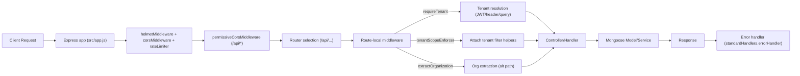

# Backend API Analysis (Express + MongoDB)

## Overview

This document provides a thorough analysis of the Express backend API for the Data Management Dashboard. It enumerates all HTTP routes/endpoints, their HTTP methods and paths, how they map to controllers/handlers, the middleware chains applied (authentication, tenant scoping, validation, error handling), the data models/services in use, and the request/response behaviors including pagination, sorting, filtering, and typical status codes. It also explains cross-cutting security (JWT, Super Admin/T0000 bypass, rate limiting, CORS/Helmet) and utilities that influence API behavior. All file paths listed below are relative to the backend container root: mongodb_dashboard_backend.

The implementation uses Express.js, Mongoose, and a multi-tenant approach enforced via tenant-aware middleware. Swagger/OpenAPI is generated dynamically and served from this backend for discovery and docs.

## Server Composition and Cross-Cutting Middleware

- Main wiring:
  - src/app.js
  - src/server.js

- Security and infrastructure middleware:
  - src/middleware/security.js
    - corsMiddleware(): CORS with computed whitelist and permissive same-host fallback
    - helmetMiddleware(): security headers with CSP disabled to avoid conflicts with Swagger
    - rateLimiter(): configurable rate limiter (skips GET by default)
  - src/middleware/permissiveCors.js
    - permissiveCorsMiddleware: echo Origin and robust preflight on /api/*
  - Mounted in app.js:
    - helmetMiddleware (global)
    - corsMiddleware (global)
    - permissiveCorsMiddleware (under /api)
    - app.options('/api/*', cors()) for preflights
    - rateLimiter (global)
    - compression (gzip/brotli) when ENABLE_RESPONSE_COMPRESSION=true

- Swagger/OpenAPI:
  - swagger.js (getBaseOpenApiSpec)
  - app.js serves:
    - GET /openapi.json, /api-docs.json, /api/docs.json
    - Swagger UI at /api-docs, /api/docs, /docs

- Health and Root:
  - In-app health: GET /api/health, /health, /healthz, /ready, /live
  - Root landing: GET / returns compact JSON

- Error Handling:
  - src/middleware/standardHandlers.js
    - errorHandler: standardized JSON error envelope mounted in app.js (final handler)
  - src/middleware/errorHandler.js exists but not mounted globally

- MongoDB:
  - connectDB in app.js; startup is non-blocking if DB is missing
  - Index provisioning for llm_costs is attempted on startup (best-effort)

## Tenant Scoping and Authentication

Authentication and tenant scoping are enforced per-route. Key middlewares:

- Authentication and auth context:
  - src/middleware/verifyAuth.js
    - Verifies JWT (HS/RS per config), supports demo mode when allowed
    - Extracts tenantId and roles; recognizes Super Admin and “all tenants” flags (x-all-tenants, ?all_tenants)
  - src/middleware/auth.js
    - attachAuthContext(): best-effort construction of req.user for audit and RBAC
    - requireAuth(): gate protected endpoints

- Tenant resolution/enforcement:
  - src/middleware/requireTenant.js
    - Resolves tenant from JWT (preferred), then x-organization-id/x-tenant-id headers, then query tenant_id/organization_id
    - Enforces 400 on missing tenant; 403 on mismatch with JWT
    - Enables Super Admin global bypass (T0000 or explicit all tenants), setting req.tenantScopeDisabled/allTenants
    - Mirrors tenant to req.tenantId and emits X-Applied-* headers
  - src/middleware/tenantScopeEnforcer.js
    - Attaches helpers: withTenantFilter, withTenantAggregation, stampTenant; enforces tenant_id unless bypass active
  - src/middleware/extractOrganization.js
    - Alternative tenant resolver; supports Super Admin bypass (sets global mode)

- Super Admin bypass:
  - T0000 and/or x-all-tenants true enable global mode; tenant filters are skipped and headers X-All-Tenants/X-Applied-Tenant=all-tenants are set

- Rate limiting + CORS apply regardless of auth; configured permissively for preview/dev

## Routing Topology and Endpoint Mapping

All API routes are mounted under /api (except health root). Base router at src/routes/index.js mounts users.summary before users to preserve /summary precedence.

Below each endpoint group lists the mounted path, HTTP method, handler mapping, middleware chain, models/services involved, and status/behavior.

### Health and Docs

- GET /api/health (src/app.js)
  - Middleware: Helmet, CORS, Rate Limiter, permissive CORS (under /api)
  - Response: { status: "ok", db: connected|connecting|disconnected, timestamp }
  - Status: 200

- GET /openapi.json, /api-docs.json, /api/docs.json (src/app.js)
  - Returns dynamic OpenAPI (host-aware)
  - Status: 200

- GET /api-docs, /docs (src/app.js)
  - Swagger UI

### Authentication

Router: src/routes/auth.routes.js (mounted at /api/auth)

- GET /api/auth/health
  - Handler: inline in router
  - Returns config flags for tenant salt without exposing secrets
  - Status: 200

- POST /api/auth/signup
  - Validates { organization_id, email, password } (422 on validation errors)
  - Ensures tenant/org salt; hashes password with v2 scheme; upserts User
  - Models: Tenant, User
  - Status: 201 on success; 400/422 on errors

- POST /api/auth/login
  - Validates body; resolves tenant; verifies/migrates hash; issues HS256 JWT if secret configured, else “ok” demo in dev
  - Models: Tenant, User
  - Response: { success, tenant_id, token/id_token, token_type, user }
  - Status: 200, 400/401/422

- POST /api/auth/reset-password
  - Validates; ensures tenant/org salt; rehashes with v2 and updates User
  - Models: Tenant, User
  - Status: 200, 400/404/422

### LLM Costs (Tabular list, CRUD, hierarchy)

Routers and mounts:
- /api/llm-costs → src/routes/llmCosts.public.routes.js
- /api/llm-costs → src/routes/llmCosts.routes.js (CRUD)
- /api/llm-costs → src/routes/llmCosts.hierarchy.routes.js (hierarchy)

Models:
- src/models/llmCosts.model.js (collection defaults to “llm_costs”; configurable)

Middleware (per router):
- llmCosts.public.routes: requireTenant, tenantScopeEnforcer()
- llmCosts.routes: requireTenant, tenantScopeEnforcer()
- llmCosts.hierarchy.routes: requireTenant, tenantScopeEnforcer()

Endpoints:

- GET /api/llm-costs (Public list wrapper)
  - Handler: controllers/llmCosts.fallback.controller.listLlmCosts (invoked by public routes wrapper)
  - Behavior:
    - Tenant enforced via requireTenant; removes tenant fields from client filter
    - Pagination: page, limit≤200; sort string (e.g., -timestamp); filter whitelist enforced
    - Headers include x-effective-tenant and X-LLM-COSTS-Collection
  - Status: 200; 400 (invalid/missing tenant/filter); 403 (JWT mismatch); 500

- GET /api/llm-costs (CRUD list path)
  - Handler: crudFactory.list bound to LLMCost
  - Behavior similar to public list; uses default sort -timestamp (indexed)

- GET /api/llm-costs/{id}
  - Handler: crudFactory.getById
  - Status: 200, 400 (invalid id), 404, 403 on tenant mismatch

- POST /api/llm-costs
  - Handler: crudFactory.create; payload tenant fields overridden by server (stampTenant)
  - Status: 201; 400/422

- PUT /api/llm-costs/{id}
  - Handler: crudFactory.update; scoping enforced; stampTenant
  - Status: 200; 400/404/422

- DELETE /api/llm-costs/{id}
  - Handler: crudFactory.remove
  - Status: 200; 400/404

- GET /api/llm-costs/hierarchy
  - Router: src/routes/llmCosts.hierarchy.routes.js
  - Controller: src/controllers/llmCosts.controller.js:getHierarchy
  - Behavior: Aggregates hierarchical costs per user→projects→agents; enforces tenant; optional filter parsing
  - Status: 200; 400 (invalid filter)

- Deprecated alias note:
  - The OpenAPI lists /api/projects/{projectId}/llm-costs (deprecated). In code, the public router defines an alias under its own mount: GET /api/llm-costs/projects/:projectId/llm-costs (tenant-scoped list via controller.list). Prefer the canonical /api/llm-costs.

### Costs: Enriched and Aggregations

Routers and mounts:
- /api/costs → src/routes/llmCosts.enriched.routes.js
- /api/costs → src/routes/costs.organization.routes.js
- /api/costs → src/routes/costs.byAgent.routes.js

Endpoints:

- GET /api/costs (Enriched list)
  - Router: src/routes/llmCosts.enriched.routes.js
  - Middleware: resolveTenantScope (lightweight resolver)
  - Controller: src/controllers/costs.enriched.controller.js:listEnrichedCosts
  - Behavior:
    - Joins llm_costs -> users by user_id to add user_display_name
    - Pagination: page, limit≤200; sort; filter whitelist
    - Headers: x-effective-tenant, x-tenant-source, x-costs-* timings
  - Status: 200; 400 (invalid filter/tenant)

- GET /api/costs/{organization_id} (Organization/user aggregate)
  - Router: src/routes/costs.organization.routes.js
  - Middleware: requireTenant, tenantScopeEnforcer()
  - Controller: src/controllers/costs.byOrganization.controller.js:getOrganizationUserCosts
  - Behavior: Robust aggregation by organization and user with normalized numeric totals, project counts
  - Status: 200; 400 (missing org); 500

- GET /api/costs/by-agent (Top agents by total cost)
  - Router: src/routes/costs.byAgent.routes.js
  - Middleware: requireTenant, tenantScopeEnforcer()
  - Query: start, end (ISO optional), limit default 20 (clamped [1..100]); T0000 bypass enables global
  - Behavior: Aggregation computing { agent_name, total } sorted desc
  - Status: 200; 400 (invalid dates), 403 (tenant required)

### Users

Base mount: via src/routes/index.js → router.use('/users', users.summary then users.routes)

Models used: User, SessionTracking, Tenant

- GET /api/users (List)
  - Router: src/routes/users.routes.js
  - Middlewares:
    - usersEarlyBypassDetector (T0000 global bypass)
    - conditionalExtractOrg (extractOrganization unless bypass)
  - Handler: crudFactory.list bound to User
  - Behavior:
    - With JWT: JWT tenant enforced; conflicting header/query => 403
    - Without JWT (demo): accept header/query tenant but still enforce on filter
    - Pagination, sort, filter (JSON)
    - Headers: X-Users-Bypass, X-All-Tenants, X-Applied-Tenant, X-Applied-Filter
  - Status: 200; 400 (invalid filter); 403 (mismatch)

- GET /api/users/summary
  - Router: src/routes/users.summary.js
  - Middleware: extractOrganization() (supports global bypass)
  - Behavior:
    - Buckets by created_at for chosen range (daily/weekly/monthly/custom)
    - T0000/all-tenants: include orgBuckets (per-org series) and headers with mode hints
  - Status: 200; 400 (invalid params), 500

- GET /api/users/tenant-summary
  - Router: src/routes/users.routes.js
  - Middleware: extractOrganization()
  - Behavior:
    - Aggregates distinct active users per tenant (from session_tracking)
    - includeInactive flag extends coverage to tenants/users if no recent activity
    - Cache with TTL
  - Status: 200; 400 (invalid dates)

- GET /api/users/active-trend
  - Router: src/routes/users.routes.js
  - Behavior: Time series of distinct active users bucketed by day/week; enforces tenant alignment; caches responses
  - Status: 200; 400 (invalid dates), 403 (tenant mismatch)

- GET /api/users/:userId/projects
  - Router: src/routes/users.routes.js
  - Service: src/services/users.service.js:getUserProjectsFromSessions
  - Requires: userId path param; organization_id|tenant_id (header/query) or context
  - Response: { user_id, tenant_id, projects: [ { project_id, project_name?, last_activity? } ] }
  - Status: 200 (empty projects on fallback), 400 (missing params)

- GET /api/users/:id, PUT /api/users/:id, DELETE /api/users/:id
  - Handlers: crudFactory.getById/update/remove
  - Validation: ObjectId; 404 (not found), 400 (invalid id), 422 (validation)

- GET /api/users/seed-if-empty
  - Seeds demo users only if collection empty
  - Status: 200

### Session Tracking

Router: src/routes/sessionTracking.routes.js

- GET /api/session-tracking
  - Early bypass T0000; otherwise enforce tenant (from header/query/JWT)
  - Query: page/limit|pageSize; sort default -session_start; q (text search)
  - Filter param is ignored (server sets X-Filter-Ignored=true)
  - Response:
    - Envelope with meta when paginated; raw array otherwise
    - Caching: in-memory TTL with optional ETag; handles If-None-Match => 304
  - Status: 200; 304; 400 (missing tenant)

- GET /api/session-tracking/:id
  - Handler: crudFactory.getById
  - Status: 200; common error mappings via crudFactory

- POST /api/session-tracking, PUT /api/session-tracking/:id, DELETE /api/session-tracking/:id
  - Handlers: crudFactory.create/update/remove
  - Side-effect: Invalidate in-memory cache for this route

### Session / Tenant Selection

Router: src/routes/session.routes.js (mounted under /api/session; alias selection mounted under /api/tenants/select in app.js via the same router)

- Middleware: attachAuthContext() globally; requireAuth() on protected routes

- GET /api/session/tenants
  - Returns normalized tenants from user record; audit trail recorded
  - Status: 200; 401

- POST /api/session/tenant
  - Validates RBAC and sets active tenant cookie; audit trail recorded
  - Status: 200; 400; 401; 403

- POST /api/tenants/select
  - Alias to /api/session/tenant; same behavior

- POST /api/session/all-tenants
  - Super Admin only; toggles global mode; sets headers
  - Status: 200; 403

### App Deployments

Router: src/routes/appDeployments.routes.js (mounted at /api/app-deployments and alias /api/appDeployments)

- GET /api/app-deployments
  - Tenant-scoped list with page/limit/sort/filter (JSON)
  - Headers: x-effective-tenant, x-appdeploy-*
  - Model: AppDeployment
  - Status: 200; 400 (invalid filter)

- Other CRUD endpoints (by id) may be present in the same router (typical crudFactory pattern): GET/PUT/DELETE /api/app-deployments/{id}

### Projects Summary and Related

- GET /api/projects/summary
  - Router: src/routes/projects.summary.routes.js (mounted at /api/projects)
  - Middleware: extractOrganization()
  - Behavior: Time-bucketed summary from session_tracking; T0000 provides per-org series and “barData”
  - Status: 200; 400; 500

- Additional project routes reside in src/routes/projects.routes.js

### Counts

Router: src/routes/counts.routes.js

- GET /api/costs/users/count
  - Mounted under /api/costs in app.js; path is /api/costs/users/count
  - Middleware: requireTenant; T0000 bypass detection inside handler
  - Behavior: Count users in users collection for the enforced tenant; if zero, fall back to distinct user_id in session_tracking
  - Response: { success, total }
  - Status: 200

- GET /api/costs/health
  - Lightweight router health: returns { status: 'ok' }

### Analytics

- LLM cost by agent (analytics summary)
  - GET /api/analytics/llm-cost-by-agent
  - Routers: src/routes/analytics.js or src/routes/llmCosts.aggregate.routes.js (mounted under /api/analytics)
  - Controller: src/controllers/llmCost.controller.js:getLlmCostByAgentController
  - Service: src/services/llmCost.service.js:getLlmCostByAgent
  - Status: 200; 500

- Agents analytics placeholder
  - GET /api/analytics/agents
  - Router: src/routes/analyticsAgents.js
  - Response: { items: [], total: 0, meta: { limit: 50, offset: 0 } }
  - Status: 200

### Dashboard

- GET /api/dashboard/metrics
  - Router: src/routes/dashboard.routes.js
  - Middleware: verifyAuth, requireTenant
  - Behavior: Endpoint intentionally removed; returns 404 to preserve clients/tests compatibility
  - Status: 404

- GET /api/dashboard/overview
  - Router: src/routes/dashboard.modules.routes.js (mounted under /api/dashboard/overview)
  - Behavior: Minimal placeholder; returns { items: [], total: 0 }
  - Status: 200

## Data Models

- Users: src/models/user.model.js (collection: users; strict: false; indexes on organization_id, email)
- Session Tracking: src/models/sessionTracking.model.js (collection: session_tracking; indexes on tenant_id, user, and time fields)
- LLM Costs: src/models/llmCosts.model.js (collection defaults to llm_costs; configurable; indexes for tenant/timestamp and other access paths)
- App Deployments: src/models/appDeployments.model.js (collection: app_deployments; indexes for tenant, project, and sort paths)
- Projects: src/models/project.model.js (collection: projects)
- Tenants: src/models/tenant.model.js (collection: tenants; per-tenant orgSalt; associations)
- Audit Log: src/models/auditLog.model.js (collection: audit_logs)

## Services

- LLM cost analytics: src/services/llmCost.service.js
- LLM costs hierarchy: src/services/llmCostsHierarchy.service.js
- User cost aggregations: src/services/userCosts.service.js
- User projects from sessions: src/services/users.service.js
- Project name resolution: src/services/projects.service.js
- Health: src/services/health.js
- Audit trail writer: src/services/auditTrail.js

## Controller Factory (CRUD)

- src/controllers/crudFactory.js builds tenant-enforced CRUD controllers for Mongoose models:
  - Enforces tenant filters (strips client-supplied tenant keys)
  - Validates sort strings (allowlist per model)
  - Micro-caches list requests briefly
  - getById applies tenant match; create/update stamp tenant unless global bypass; remove enforces tenant scope
  - Error mapping: 200/201, 400, 404, 422

## Request/Response Behaviors

- Pagination:
  - parsePagination (utils/http) determines page, limit, skip, explicit. Many list endpoints return envelope { success, data, meta } when explicit pagination is requested; otherwise raw arrays are returned.
  - Typical max limit enforced at 200 (or per-route clamp).

- Sorting:
  - “field” or “-field” strings; allowed fields constrained by controller/model allowlists (e.g., timestamp, created_at, _id). Defaults are chosen for indexed access.

- Filtering:
  - Filter JSON parsing; invalid JSON returns 400.
  - Tenant scoping overrides/removes client-supplied tenant fields. With JWT in effect, conflicting tenant headers/queries yield 403.

- Headers:
  - Diagnostic headers: X-Applied-Tenant, X-Applied-Filter, X-All-Tenants, X-Model-Collection
  - Route-specific: llm-costs X-LLM-COSTS-Collection; costs enriched x-costs-* timings; metrics users X-Users-*; session tracking X-Cache/ETag; etc.

- Status codes:
  - 200 for successful reads; 201 for creates; 400 for invalid inputs; 401 for missing/invalid auth on protected routes; 403 for tenant mismatches/forbidden; 404 for not found; 422 for validation errors; 500/503 for server/DB issues; 304 for ETag cache validations.

## Security Considerations

- Authentication:
  - Some routes require verifyAuth and/or requireAuth (e.g., dashboard, metrics users, session).
  - Others rely on tenant resolution and scoping with or without JWT, but enforce tenant constraints on filtering.

- Authorization and Tenant Scoping:
  - Strict tenant enforcement via requireTenant and tenantScopeEnforcer; extractOrganization provides an alternative flow.
  - Super Admin global mode (T0000 or x-all-tenants/param) intentionally bypasses tenant filters; headers expose this mode.

- Rate limiting:
  - Global limiter configured; GET often skipped. Adjust env settings to harden for production.

- CORS:
  - corsMiddleware + permissiveCorsMiddleware provide flexible behavior suitable for dev/preview; consider stricter whitelists in production.

- Hashing and tenant salts:
  - authHash utilities implement versioned hashing (argon2id/bcrypt/scrypt) with per-tenant salt (orgSalt); auth routes rely on Tenant config.

## Error Cases and Handling

- Central error handler (standardHandlers.errorHandler) maps Mongoose cast errors to 400, validation to 422, network/DB issues to 503, others to 500.
- Common cases:
  - Missing tenant => 400
  - Tenant mismatch with Authorization => 403
  - Invalid filter JSON => 400
  - Invalid ObjectId => 400/404
  - Validation failures => 422
  - Server errors => 500

## High-Level Request Flow

## Endpoint Index (Quick Reference)

- Health/Docs:
  - GET /api/health — src/app.js
  - GET /openapi.json — src/app.js
  - GET /api-docs — src/app.js

- Auth:
  - GET /api/auth/health, POST /api/auth/signup, POST /api/auth/login, POST /api/auth/reset-password — src/routes/auth.routes.js

- LLM Costs:
  - GET /api/llm-costs — src/routes/llmCosts.public.routes.js and src/routes/llmCosts.routes.js
  - GET /api/llm-costs/{id}, POST /api/llm-costs, PUT /api/llm-costs/{id}, DELETE /api/llm-costs/{id} — src/routes/llmCosts.routes.js
  - GET /api/llm-costs/hierarchy — src/routes/llmCosts.hierarchy.routes.js

- Costs:
  - GET /api/costs — src/routes/llmCosts.enriched.routes.js
  - GET /api/costs/{organization_id} — src/routes/costs.organization.routes.js
  - GET /api/costs/by-agent — src/routes/costs.byAgent.routes.js
  - GET /api/costs/users/count — src/routes/counts.routes.js

- Users:
  - GET /api/users — src/routes/users.routes.js
  - GET /api/users/summary — src/routes/users.summary.js
  - GET /api/users/tenant-summary — src/routes/users.routes.js
  - GET /api/users/active-trend — src/routes/users.routes.js
  - GET /api/users/:userId/projects — src/routes/users.routes.js
  - CRUD /api/users/:id — src/routes/users.routes.js
  - GET /api/users/seed-if-empty — src/routes/users.routes.js

- Session Tracking:
  - GET/POST/PUT/DELETE /api/session-tracking — src/routes/sessionTracking.routes.js

- Session/Tenant:
  - GET /api/session/tenants, POST /api/session/tenant, POST /api/tenants/select, POST /api/session/all-tenants — src/routes/session.routes.js

- Projects:
  - GET /api/projects/summary — src/routes/projects.summary.routes.js
  - Other project routes — src/routes/projects.routes.js

- Analytics:
  - GET /api/analytics/llm-cost-by-agent — src/routes/analytics.js or src/routes/llmCosts.aggregate.routes.js
  - GET /api/analytics/agents — src/routes/analyticsAgents.js

- Dashboard:
  - GET /api/dashboard/metrics — src/routes/dashboard.routes.js (404 placeholder)
  - GET /api/dashboard/overview — src/routes/dashboard.modules.routes.js

For full schemas and examples, see interfaces/openapi.json; code takes precedence on behaviors such as tenant scoping and headers.

## References (Key Files)

- App/server: src/app.js, src/server.js
- Routers:
  - src/routes/index.js
  - src/routes/llmCosts.public.routes.js
  - src/routes/llmCosts.routes.js
  - src/routes/llmCosts.hierarchy.routes.js
  - src/routes/llmCosts.enriched.routes.js
  - src/routes/costs.organization.routes.js
  - src/routes/costs.byAgent.routes.js
  - src/routes/analytics.js
  - src/routes/analyticsAgents.js
  - src/routes/users.routes.js
  - src/routes/users.summary.js
  - src/routes/sessionTracking.routes.js
  - src/routes/session.routes.js
  - src/routes/appDeployments.routes.js
  - src/routes/projects.summary.routes.js
  - src/routes/counts.routes.js
  - src/routes/metrics.users.routes.js
  - src/routes/dashboard.routes.js
  - src/routes/dashboard.modules.routes.js
  - src/routes/auth.routes.js
- Middleware:
  - src/middleware/requireTenant.js
  - src/middleware/tenantScopeEnforcer.js
  - src/middleware/extractOrganization.js
  - src/middleware/verifyAuth.js
  - src/middleware/security.js
  - src/middleware/permissiveCors.js
  - src/middleware/standardHandlers.js
- Controllers/Services:
  - src/controllers/crudFactory.js
  - src/controllers/llmCost.controller.js
  - src/controllers/llmCosts.controller.js
  - src/controllers/costs.enriched.controller.js
  - src/controllers/costs.byOrganization.controller.js
  - src/services/llmCost.service.js
  - src/services/llmCostsHierarchy.service.js
  - src/services/users.service.js
  - src/services/projects.service.js
  - src/services/auditTrail.js
- Models:
  - src/models/llmCosts.model.js
  - src/models/user.model.js
  - src/models/sessionTracking.model.js
  - src/models/appDeployments.model.js
  - src/models/tenant.model.js
  - src/models/auditLog.model.js
- OpenAPI:
  - interfaces/openapi.json
